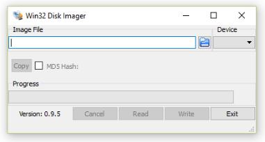
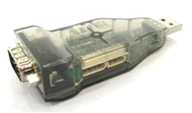
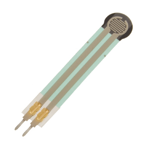
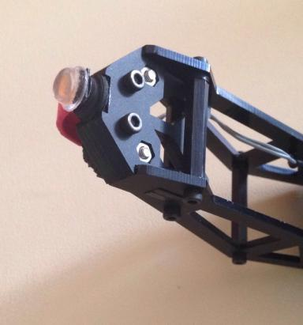
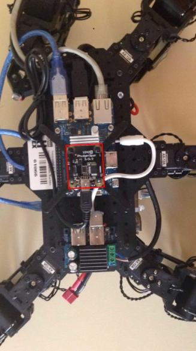
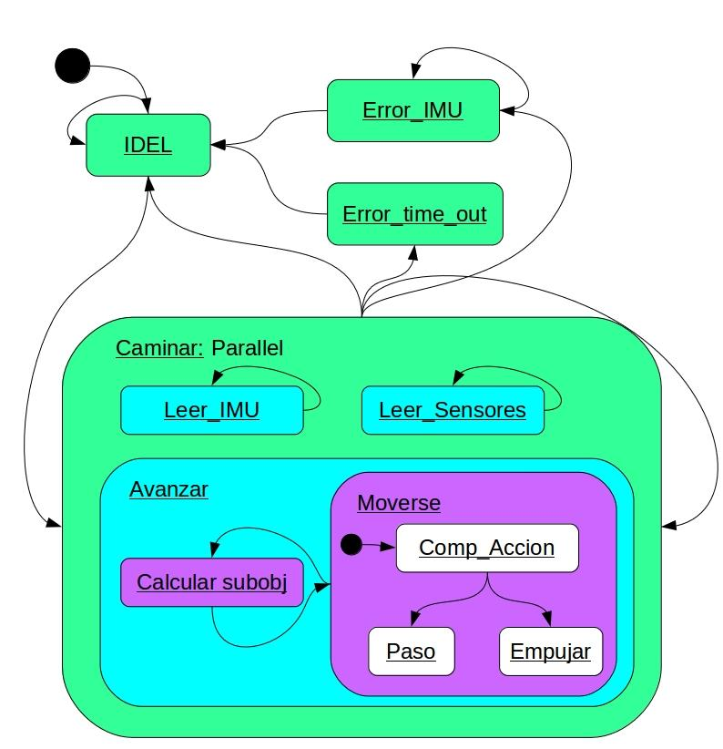

#Hexapod-robot

This repository contains the components, to control the robot phantom-x.

First, you should clone the robocomp repository and install in your pc. As indicated in the link:

	https://github.com/robocomp/robocomp/blob/master/README.md

Once already installed robocomp, you should clone this repository in your pc, with the next line:

	https://github.com/ibarbech/hexapod-robot.git

To run the components, you should have a phantom-x with a odroid, then,  I explain the steps are set to build the phantom-x

##Make hexapod with phantom-x

###Initial Setup Odroid

In this chapter we are going to explain how setup the environment that we need to run our components.

Materials:

* Odroid c1+

* sd memory card class A

* hdmi cable

* rj45 cable

The first step is downloading the necessary software to prepare the memory card. We used SD Formatter 4.0, available on https://www.sdcard.org/.

Only select the memory card path and select format.

Now, we are going to burn a odroid image on our Odroid C1. We can find the image on http://odroid.com/ and then we’ll burn it on the memory card with win32DiskImager.

When the process is finished, we insert the memory in the Odroid C1 and we’ll connect all.

####First setup

This O.S. is similar to another Linux distribution that you could install in your personal computer. 

Firstly, we are going to install robocomp, an open-source Robotics framework providing the tools to create and modify software components that communicate through public interfaces.

#####Installing Robocomp

Requeriments:

	$ sudo apt-get update

	$ sudo apt-get install git git-annex cmake g++ libgsl0-dev libopenscenegraph-dev cmake-qt-gui zeroc-ice35 freeglut3-dev libboost-system-dev libboost-thread-dev qt4-dev-tools yakuake openjdk-7-jre python-pip  python-pyparsing python-numpy python-pyside pyside-tools libxt-dev pyqt4-dev-tools qt4-designer libboost-test-dev libboost-filesystem-dev

#####Installation of Robocomp

We followed the indications that provide from robocomp Github. 

	https://github.com/robocomp/robocomp

#####Installing Dynamixel SDK

Steps:
	
	$ sudo apt-get update && sudo apt-get upgrade
	$ sudo apt-get install libusb-dev
	$ mkdir DinamixelSDK && cd DinamixelSDK
	$ wget http://support.robotis.com/en/baggage_files/dynamixel_sdk/dxl_sdk_linux_v1_01.zip
	$ unzip dxl_sdk_linux_v1_01.zip
	$ cd src
	$ make
	$ cp libdxl.a /lib/libdxl.a

#####Installing PyDinamixel

Steps

	$ sudo pip install pyserial
	$ cd
	$ mkdir software
	$ cd software
	$ git clone https://github.com/richard-clark/pydynamixel
	$ cd pydynamixel/
	$ sudo python setup.py install

You can check that PyDynamixel is installed writting this commands:

	$ python
	>>> from pydynamixel import dynamixel

We’ll know if all it’s ok if we don’t see any kind of error.

###Clone repository hexapod-robot

Once we get installed dynamixel and robocomp, we'll clone this repository, for that we can control the dynamixel motors and for that we can read pressure sensors.

	https://github.com/ibarbech/hexapod-robot.git

For the communication between odroid and  the dynamixel motor we need the adapter usb2dynamixel.

###Connect the Dynamixel motors to odroid

Phantom-x use the motors model AX-12 by Dynamixel and these motors use the ttl communications. For its connect we'll follow the next steps:

* Connect the motors as a bus.

* Connect VCC 12V.

* Connect a this bus the adapter usb2dynamixel.

* Connect the adapter to odroid and we set position the connection switch in TTL.

If we want to check the connection the Dynamixel motors, we can to download the program RoboPlusWeb(v1.1.3.0).exe and install in Windows following the next steps:

* Install de program.

* Run de program and select Expert and Dynamixel Wizard.

* Connect Usb2Dynamixel to Windows pc.

* Select port and click connect.

* Select bps of search and click Search Start.

Now, to the left show the motors found.

If appear all motors that we connect, the conecction is correct.

###Install Pressure sensors

Each leg will have a pressure sensor, these sensors will connect to a Arduino. On This Arduino will have loaded the program "sensorPresion.ino" 

* The sensor of leg 1 will connect to pin A0.

* The sensor of leg 2 will connect to pin A1.

* The sensor of leg 3 will connect to pin A2.

* The sensor of leg 4 will connect to pin A3.

* The sensor of leg 5 will connect to pin A4.

* The sensor of leg 6 will connect to pin A5.

###Install IMU

For to check the orientation the hexapod we will install the adapter IMU, that it is connected to the odroid.

###State Machine Hexapod

The leghexapod componet have a state machine for moving.

###Run the components in Odroid

####dynamixelphython

For run the componet dynamixelpython we will follow the next steps:

We will move to directory "<use-name>/hexapod-robot/dynamixelpython":

	$ cd <use-name>/hexapod-robot/dynamixelpython

Execute these two line:

	$ cmake .
	$ make -j2

Execute the next line:

	$ src/dynamixelpython.py etc/config

####footpreassuresensor

For run the componet footpreassuresensor we will follow the next steps:

We will move to directory "<use-name>/hexapod-robot/footpreassuresensor":

	$ cd <use-name>/hexapod-robot/footpreassuresensor

Execute these two line:

	$ cmake .
	$ make -j2

Execute the next line:

	$ bin/FootPreassureSensor etc/config

####phidgetimu

For run the componet footpreassuresensor we will follow the next steps:

We will move to directory "home/robocomp/robocomp/components/robocomp-robolab/components/phidgetimu/":

	$ cd home/robocomp/robocomp/components/robocomp-robolab/components/phidgetimu/

Execute these two line:

	$ cmake .
	$ make -j2

Execute the next line:

	$ sudo bin/phidgetimu etc/config

##Start components in your PC 

###leghexapod

This component controls to a leg, therefore we will run a component for each leg.

This component contain a state machine, and implement the interface "LegController" and it comunicates with "phidgetimu" for stabilize the hexapod, with "footpreassuresensor" for detect if a leg is resting in floor, and with "dynamixelphython" for send the position to each motor.

For execute this component we will run the next lines:

	$ cd <user-name>/hexapod-robot/leghexapod
	$ cmake .
	$ make -j2
	$ sh starthexapod.sh

For stop the execution we will run the next line:

	$ killall -9 LegControllerComp

###brainhexapod

This component contain the code for that the hexapod can walk.

For execute this component we will run the next lines:

	$ cd <user-name>/hexapod-robot/brainhexapod
	$ cmake .
	$ make -j2
	$ bin/brainhexapod config

###showSensorHexapod

if we want to see the pressure of each leg, we will run this componet with the next steps:

	$ cd <user-name>/hexapod-robot/showSensorHexapod
	$ cmake .
	$ make -j2
	$ src/showSensorHexapod.py  etc/config

##Video Hexapod Robolab UEX

